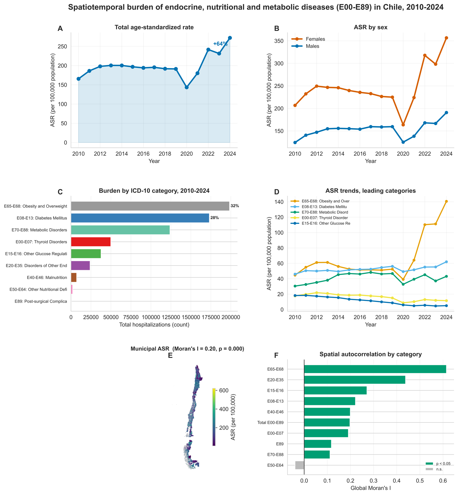
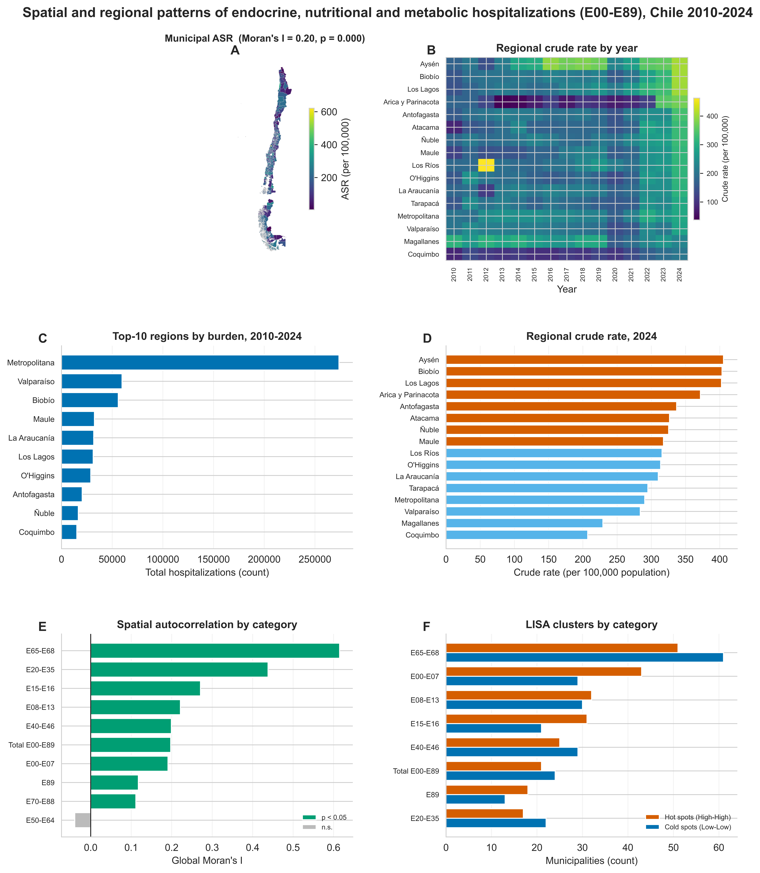
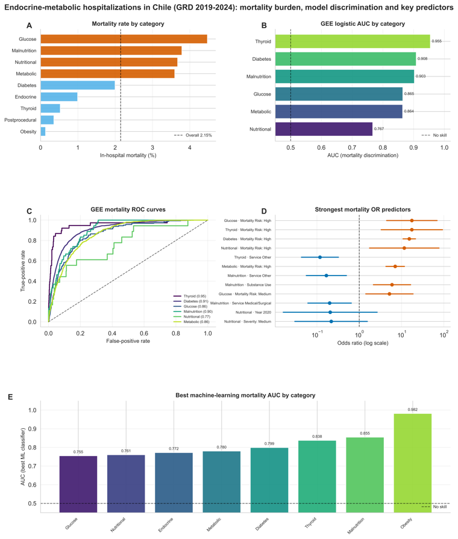
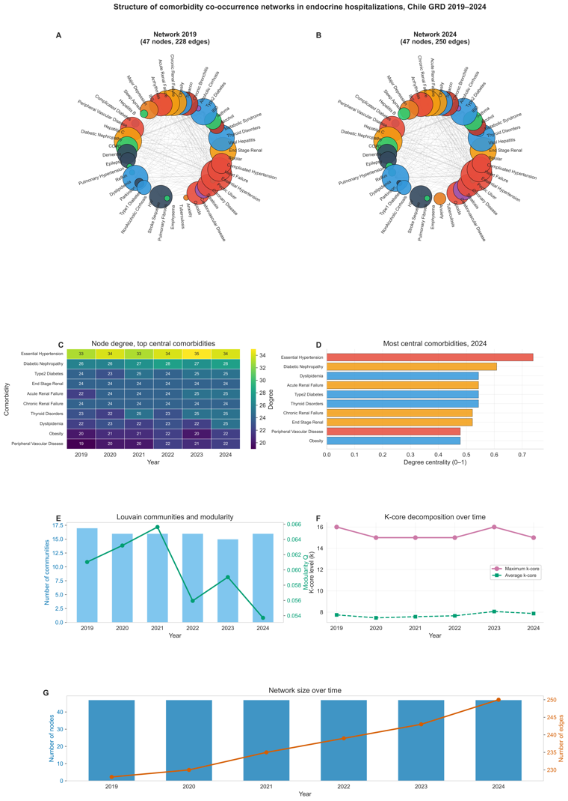

<div align="center">

# 🩺 Endocrine, Nutritional & Metabolic Diseases in Chile
### Enfermedades endocrinas, nutricionales y metabólicas (CIE-10 **E00–E89**)
**A nationwide hospitalization analysis · GRD / DEIS, 2010–2024**

[](https://quarto.org)
[](https://www.python.org)
[](#-live-site)
[](#-data--methods--datos-y-métodos)
[](#-reproducibility--reproducibilidad)

<br>



<sub>Graphical abstract · resumen gráfico (Part 1). Full interactive reports below.</sub>

<br><br>

### 🌐 Live site
**https://amarusimonaguerojimenez.github.io/Endocrine-nutritional-and-metabolic-diseases-E00-E89-in-Chile/**
<sub>(update after enabling GitHub Pages — see <a href="#-deploy-github-pages">Deploy</a>)</sub>

</div>

---

## 📋 Overview · Descripción

This repository publishes three complementary, **fully reproducible** analyses of hospitalizations for **endocrine, nutritional and metabolic diseases (ICD-10 E00–E89)** in Chile, based on public **GRD (Grupos Relacionados de Diagnóstico)** and **DEIS** hospital-discharge records. Every report is a self-contained, peer-review-ready document with publication-quality (1200 dpi) figures and composite "graphical-summary" figures.

> *Este repositorio publica tres análisis complementarios y **reproducibles** de las hospitalizaciones por enfermedades endocrinas, nutricionales y metabólicas (CIE-10 E00–E89) en Chile, a partir de los registros públicos de egresos hospitalarios del sistema GRD y del DEIS.*

## 📊 Reports · Reportes

| | Report | Focus | Link |
|---|--------|-------|:----:|
| **1** | **Spatiotemporal burden & spatial clustering** | Age-standardized rates 2010–2024 by sex & ICD category, temporal trends, the 2020 pandemic dip, municipal **Moran's I / LISA** | [📄 open](docs/endocrinas_parte1.html) |
| **2** | **In-hospital mortality & length of stay** | **GEE** logistic / negative-binomial models by category, **OR/IRR** forest plots, ROC/AUC, machine-learning risk prediction (2019–2024) | [📄 open](docs/endocrinas_parte2.html) |
| **3** | **Comorbidity network analysis** | Jaccard co-occurrence networks, **Louvain** communities, centrality, **k-core** decomposition (2019–2024) | [📄 open](docs/endocrinas_redes.html) |
| **+** | **Network analysis in health (methods)** | Spanish theory chapter: foundations, centralities, community detection, comorbidity networks | [📘 open](docs/analisis_redes_salud.html) |

▶ Start at the landing page: **[`docs/index.html`](docs/index.html)**

## 🖼️ Figure gallery · Galería

<div align="center">
<table>
<tr>
<td align="center" width="33%"><br><sub><b>Spatial</b> · ASR maps & Moran's I</sub></td>
<td align="center" width="33%"><br><sub><b>Outcomes</b> · mortality, ROC, OR</sub></td>
<td align="center" width="33%"><br><sub><b>Networks</b> · comorbidity co-occurrence</sub></td>
</tr>
</table>
</div>

## 👥 Authors · Autores

| Author | Email |
|--------|-------|
| Dominga Elena Ramírez Reyes | dominga.ramirez@ug.uchile.cl |
| María Matilde Vicuña Watkins | maria.vicuna@ug.uchile.cl |
| Antonia Fernanda Troncoso Páez | antonia.troncoso.p@ug.uchile.cl |
| Josefina Poblete Moreno | josefina.poblete@ug.uchile.cl |
| **Amaru Simón Agüero Jiménez** · _corresponding_ · [ORCID](https://orcid.org/0000-0001-7336-1833) | a.agueroj@udd.cl |

## 🗂️ Repository structure

<details>
<summary>Click to expand</summary>

```
.
├── docs/                              ← published site (GitHub Pages source)
│   ├── index.qmd · index.html               landing page
│   ├── endocrinas_parte1.qmd · .html        spatiotemporal
│   ├── endocrinas_parte2.qmd · .html        mortality & length of stay
│   ├── endocrinas_redes.qmd · .html         comorbidity networks
│   ├── analisis_redes_salud.qmd · .html     network-analysis methods (ES)
│   ├── *.bib · *.csl                         bibliography & citation style
│   └── .nojekyll
├── assets/                            ← README preview images
├── data/                              ← raw GRD/DEIS data + 1200-dpi figures (git-ignored)
├── .gitignore
└── README.md
```
</details>

Reports use Quarto `embed-resources: true`, so each `.html` is **self-contained** — the site needs nothing from `data/`.

## 🔁 Reproducibility · Reproducibilidad

- **Software:** Python (pandas, NumPy, statsmodels, scikit-learn, NetworkX, GeoPandas, libpysal/esda, Matplotlib/Seaborn) via [Quarto](https://quarto.org).
- **Re-render:** place the raw data under `data/` and run `quarto render docs/<file>.qmd`.
- **Figures:** written to `data/output_files/<report>/` at 1200 dpi (git-ignored; already embedded in the reports).

## 🚀 Deploy (GitHub Pages)

```bash
cd endocrinas
git add -A && git commit -m "Update site"
git branch -M main
git remote add origin https://github.com/AmaruSimonAgueroJimenez/Endocrine-nutritional-and-metabolic-diseases-E00-E89-in-Chile.git
git push -u origin main
```

Then **Settings → Pages → Deploy from a branch → `main` / `/docs`**. Live in ~1 minute.

## 📚 Data & methods · Datos y métodos

- **Source:** Chilean Ministry of Health — **GRD** and **DEIS** public hospital-discharge records.
- **Population:** primary diagnosis ICD-10 **E00–E89**.
- **Period:** 2010–2024 (spatiotemporal) · 2019–2024 (outcomes & networks).
- Raw GRD/DEIS data are **not redistributed** here (≈7 GB; publicly available from the source).

## 📝 How to cite

```
Agüero Jiménez, A. S., Ramírez Reyes, D. E., Vicuña Watkins, M. M.,
Troncoso Páez, A. F., & Poblete Moreno, J. (2026). Endocrine, Nutritional
and Metabolic Diseases (E00–E89) in Chile: a nationwide hospitalization
analysis (GRD/DEIS, 2010–2024). https://github.com/AmaruSimonAgueroJimenez/Endocrine-nutritional-and-metabolic-diseases-E00-E89-in-Chile
```

## ⚖️ License

Recommended: **CC BY 4.0** for the reports/figures (add a `LICENSE` file to make it formal). Underlying GRD/DEIS data are governed by the Chilean Ministry of Health terms.

<div align="center"><sub>Made with ❤️ and <a href="https://quarto.org">Quarto</a> · Universidad de Chile</sub></div>
